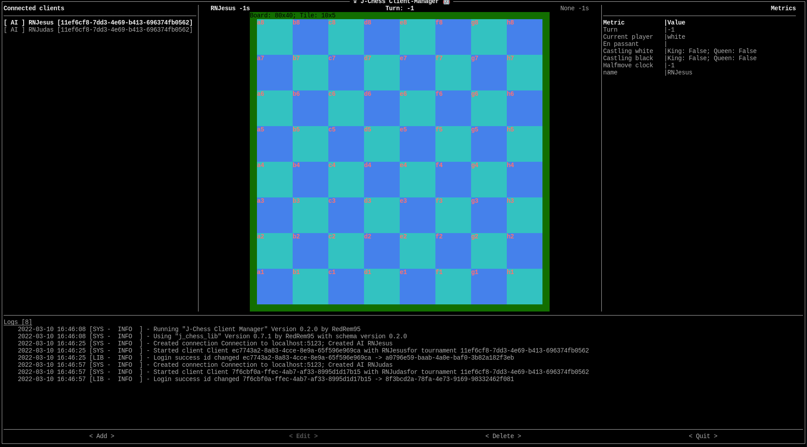
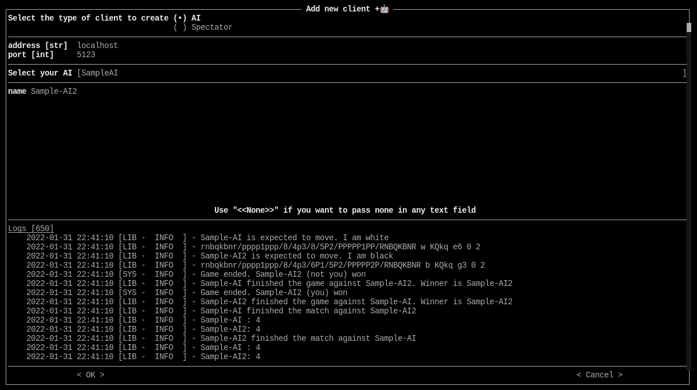

===================
j-chess bot manager
===================

.. image:: https://img.shields.io/pypi/v/j_chess_client_manager.svg
        :target: https://pypi.python.org/pypi/j_chess_client_manager

.. image:: https://readthedocs.org/projects/j-chess-client-manager/badge/?version=latest
        :target: https://j-chess-client-manager.readthedocs.io/en/latest/?version=latest
        :alt: Documentation Status

Manager for bots designed for the awesome j-chess-server using the j-chess-lib for python

* Free software: GNU General Public License v3
* Documentation: https://j-chess-client-manager.readthedocs.io.

Features
--------

* Start clients using a UI
* See the current playstate of your clients

Screenshots
###########

Screenshot showing the main UI with the chessboard, logs, metrics, clients

Screenshot showing menu to add a new AI

TODO
####

* Make clients stoppable
* Performance improvements
* Let user define own metrics to be shown

Usage
-----

Implement your AI by implementing the AI class from j-chess-lib_. See `j-chess-lib Usage`_ for usage instructions.

Then install the bot manager using

.. code-block::

    $pip install j_chess_bot_manager

Then start the manager by calling

.. code-block::

    $j_chess_client_manager --with-package to.your.package

Where ``to.your.package`` should be the import statement to the package/pythonfile with your implemented ai from the
current working directory.

Use

.. code-block::

    $j_chess_client_manager --help

to see all available options

Credits
-------

* Idea and server generated by the nice JoKrus_
* This package was created with Cookiecutter_ and the `audreyr/cookiecutter-pypackage`_ project template.

.. _Cookiecutter: https://github.com/audreyr/cookiecutter
.. _`audreyr/cookiecutter-pypackage`: https://github.com/audreyr/cookiecutter-pypackage
.. _j-chess-lib: https://github.com/RedRem95/j-chess-lib
.. _`j-chess-lib Usage`: https://j-chess-lib.readthedocs.io/en/latest/usage.html
.. _JoKrus: https://github.com/JoKrus
